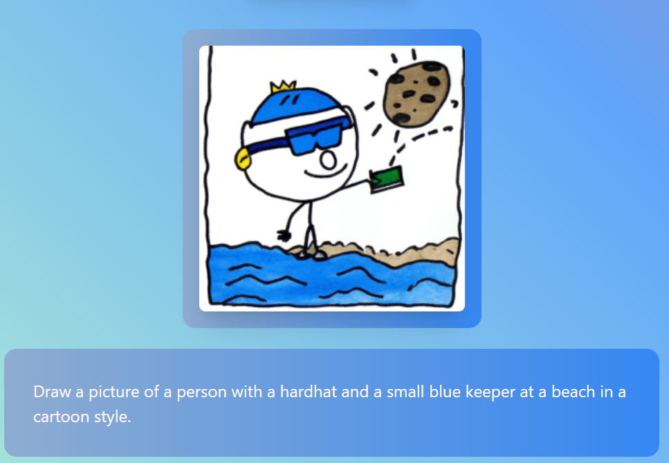

# TAIlor

<div align="center"> </div>


## About The Project

Tailor is a tool that enables artists to overcome their mental blocks in a fun and engaging manner, while leveraging AI technology. AI is very powerful, but finding the right prompt can sometimes be tricky, especially for children or those with special needs. With our easy to use app, anyone can find inspiration as swiftly as possible.

[Devpost Link](https://devpost.com/software/tailor-s529oy?ref_content=my-projects-tab&ref_feature=my_projects)

## Project Showcase

Output:


## Installation

Download or clone this repository in order to use TAIlor.


Use the framework [Node](https://nodejs.org/en/download/) to install Node JS and to use npm.

Then install the following packages using:
```bash
npm install all
```

In addition, you will need individual API keys for:
- Cohere NLP
- Twilio

Then open the local host or visit [TAIlor](https://www.tailorswift.tech/)

## Extensions
Twilio Part of API Project -> https://github.com/rymarktron/server-for-twilio

Chrome extension -> https://github.com/rymarktron/project-vite
